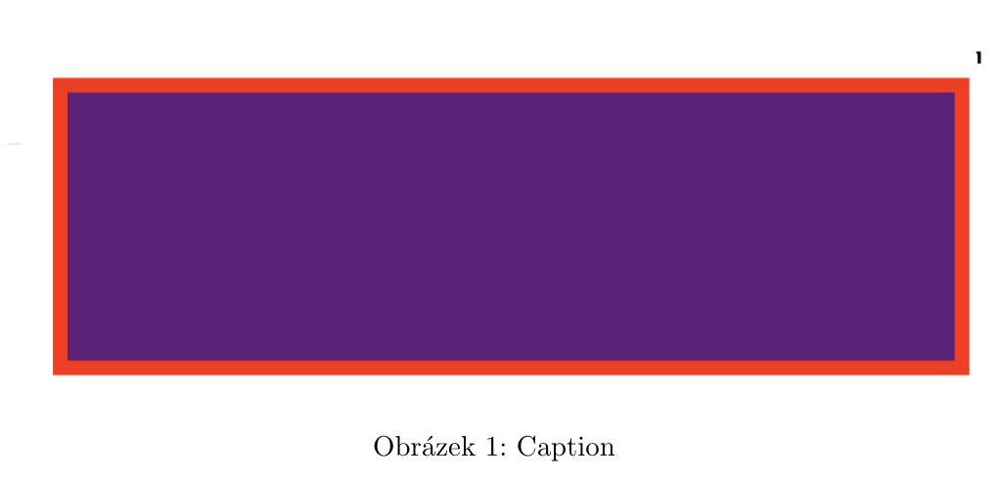
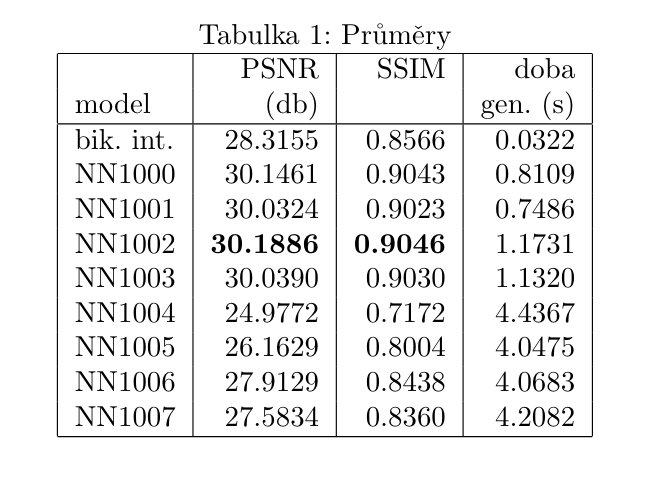
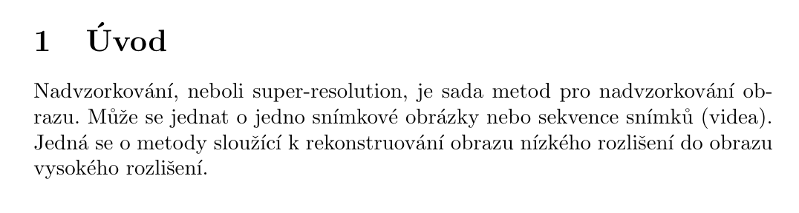
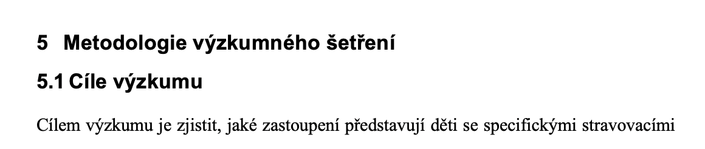

# obecné chyby

::: tip
úvod, závěr a abstrakt se píší až úplně na závěr! to je to poslední na čem budete pracovat.
:::

## todo jak začít
osnova až na odstavce

každá první věta musí dávat smysl i bez zbytku odstavce

## abstrakt
do abstraktu patří:
- jaká je oblast výzkumu, 
- co je za probém,
- jak to metodicky řeíme, 
- jaké výslekdy máme a co to přináší/jaké jsou možnosti využití,
- plus možná další směřování..

## obrázky

popisek obrázku umístěn pod obrázkem a musí být jasný! je třeba aby i v seznamu obrázků bylo jasné co obsahuje.

```latex
\begin{figure}
    \centering
    \includegraphics[width=\columnwidth]{./overleaf-share-link.png}
    \caption{popisek který v seznamu obrázků dává smysl}
    \label{fig:my_label}
\end{figure}
```



## tabulky

tabulka musí mít hlavičku, popisek (caption) umístěný nad tabulkou.

```latex
\begin{table}[hbt!]  
\centering
\caption{průměry}
\begin{tabular}{| l | r | r | r | }
\hline
        &        psnr &      ssim &      doba  \\
model &       (db)    &           & gen. (s) \\
\hline
bik. int. & 28.3155 & 0.8566 & 0.0322 \\
nn1000    & 30.1461 & 0.9043 & 0.8109 \\
nn1001    & 30.0324 & 0.9023 & 0.7486 \\
nn1002    & \textbf{30.1886} & \textbf{0.9046} & 1.1731 \\
nn1003    & 30.0390 & 0.9030 & 1.1320 \\
nn1004    & 24.9772 & 0.7172 & 4.4367 \\
nn1005    & 26.1629 & 0.8004 & 4.0475 \\
nn1006    & 27.9129 & 0.8438 & 4.0683 \\
nn1007    & 27.5834 & 0.8360 & 4.2082 \\
\hline
\end{tabular}
\end{table}
```




## todo překlady + polopřeklady

## nejednotnost slov

během práce narazíte určitě na slova, kde si nebudete jistí jak je psát. příkladem může být: `super-resolution` nebo `superresolution` nebo `super resolution`. v podstatě nejde i nic. jen by jste se měli ve své práci držet jednoho oznašení. nejjednodužší je použít systémové řešení.

definice výrazu
```latex
\newcommand\superresolution{super-resolution}
```

pužití v textu je pak jednoduché!
```latex
nadvzorkování, neboli \superresolution, je sada metod pro nadvzorkování obrazu. může se jednat o jedno snímkové obrázky nebo sekvence snímků (videa). jedná se o metody sloužící k rekonstruování obrazu nízkého rozlišení do obrazu vysokého rozlišení. 
```

výsledek:


ti co používájí word se musí spolehnout jen na sebe :|.

## todo citování

citování je několik možností. já používám tyhle 3 základní formy.

věta (před tečkou)
```latex
architekturu dopředné (vrstvené, vícevrstvé, acyklické) sítě tvoří acyklický graf \cite{zdroj}.
```

odstavec (za tečkou poslední věty)
```latex
lorem ipsum dolor sit amet, consectetuer adipiscing elit. nullam justo enim, consectetuer nec, ullamcorper ac, vestibulum in, elit. praesent vitae arcu tempor neque lacinia pretium. nunc dapibus tortor vel mi dapibus sollicitudin. duis sapien nunc, commodo et, interdum suscipit, sollicitudin et, dolor. vivamus luctus egestas leo. aliquam in lorem sit amet leo accumsan lacinia. integer imperdiet lectus quis justo. donec ipsum massa, ullamcorper in, auctor et, scelerisque sed, est. nam quis nulla. nam sed tellus id magna elementum tincidunt. duis pulvinar. nullam lectus justo, vulputate eget mollis sed, tempor sed magna. ut enim ad minima veniam, quis nostrum exercitationem ullam corporis suscipit laboriosam, nisi ut aliquid ex ea commodi consequatur? sed convallis magna eu sem. mauris elementum mauris vitae tortor. suspendisse nisl. aliquam erat volutpat. \cite{zdroj}
```

vyhnutí se citování několika ostavců stejným zdrojem:
```latex
podrovnější popis problematiky je nad rámec práce a je obsažen v knize taxonomie výpočetních modelů neuronových sítí:
od subregulárních jazyků k super-turingovským výpočtům
 \cite{sima_taxonomy_1996}.
```

zda se vloží číslo `[1]` nebo `(šíma, 1996)`, činý styl oblivňuje příkaz `\bibliographystyle{_czechiso}`, který se dává na konec práce před použitou literaturu. ta se vypisuje příkazem: `\bibliography{references.bib}`.


## todo odsazování

## todo vysvětlení rovnic

## todo struktura práce
kapitoly, počet atd

## 2 nadpisy u sebe

toto je špatně. je třeba pod každý nadpis odstavec. 

## seznamy
jsou 2 typy seznamů:

```latex
\begin{itemize}
    \item volba a nastavení trhu.
    \item nastavení křivek poptávek segmentů.
    \item nastavení ubytovacího zařízení, včetně kapacity a služeb.
    \item volba a nastavení distribučních kanálů.
    \item nastavení časového rámce hry, včetně počtu dní malého a velkého cyklu.
    \item nastavení rozpočtu a výkonnostních cílů hotelu.
    \item nastavení distribuce a cancellation-rate.
\end{itemize}
```

vs

```latex
\begin{itemize}
    \item volba a nastavení trhu,
    \item nastavení křivek poptávek segmentů,
    \item nastavení ubytovacího zařízení, včetně kapacity a služeb,
    \item volba a nastavení distribučních kanálů,
    \item nastavení časového rámce hry, včetně počtu dní malého a velkého cyklu,
    \item nastavení rozpočtu a výkonnostních cílů hotelu,
    \item nastavení distribuce a cancellation-rate.
\end{itemize}
```

rozdíl je v tom, že jeden má na konci vždy tečku a druhý je výčet, tedy jen první item první písmeno velké a na konci tečka.


