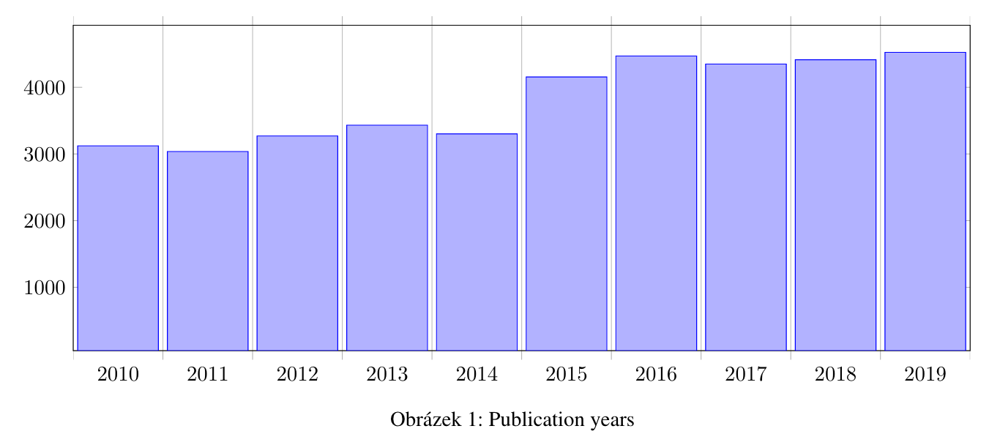
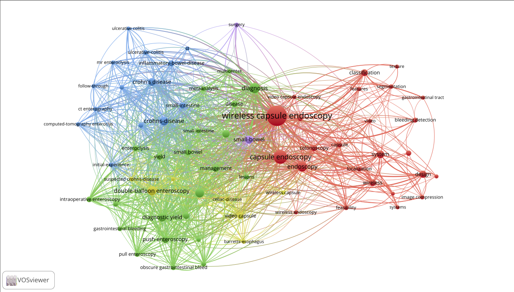

# Profi práce

## Grafy přes latex

[https://www.overleaf.com/learn/latex/Pgfplots_package](https://www.overleaf.com/learn/latex/Pgfplots_package)

```latex
\usepackage{pgfplots}
\usepackage{tikz}
```

```latex
\begin{figure}[hbt!]
\begin{tikzpicture}
\begin{axis}[
  ybar interval=0.9,
%   xtick=,% reset from ybar interval
  x tick label style={/pgf/number format/1000 sep=},
  y tick label style={/pgf/number format/1000 sep=},
  height=7cm,
  width=\textwidth,
  xmin=2010,xmax=2020
]
\addplot coordinates {
(2009, 2972)
(2010, 3122)
(2011, 3037)
(2012, 3270)
(2013, 3432)
(2014, 3301)
(2015, 4156)
(2016, 4469)
(2017, 4349)
(2018, 4413)
(2019, 4524)
(2020, 456)
};
% \legend{Year}
\end{axis}
\end{tikzpicture}

\caption{Publication years}
\end{figure}
```



## Obrázky ve vektoru (.eps)
TODO

## Obrázky renderované přes python
TODO

## WOK analýza podle výsledků přes VOSviewer
TODO návod

Výsledek




