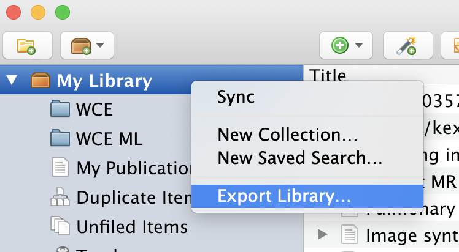

# Zotero

Zotero je citační nástroj, který Vám umožní automatizovanou správu citací. [https://www.zotero.org](https://www.zotero.org)

Obecně jde o program, který lze spustit na všech platformách a slouží jako knihovna Vašich citací. Přidat si do něj můžete libovolný zdroj. Internetový, knihu, článek, prostě cokoliv.

::: warning PERSISTENCE
Nebojte se přidat si zroje, které nevíte jistě, zda použijete. Pokud zdroje nepoužijete, ať už [LaTex](/latex) nebo Word Vám citaci nevylistuje, pokud ji nepoužijete!!
:::

## Přidávání zdroje pomocí connectoru (pluginu)

Na stánce stahování, je možno stáhnout také plugin do Vašeho prohlížeče [https://www.zotero.org/download/](https://www.zotero.org/download/). Ten velice doporučuji! Bez něj je zotero pouze poloviční pomocník.

::: warming POZOR
Pro přidávání do zotera pomocí pluginu je potřeba mít otevřené zotero na pozadí.
:::

Po kliknutí na plugin se otevře popup, kde se dá změnit knihovna. Tu větišnou použijete defaultní a obsah jež byl importován.

Důležitou pomocí zotera je také schpnost získávat open-access PDFs. Ty se Vám uloží do zotero knihovny a můžete si je kdykoliv znovu otevřit bez nutnosti hledat na internetu.

Takto pak vypadá vytvoření záznam v zoteru.

## Přidávání zdroje ručně (ISBN, DOIs, arxiv ID)

## Propojení zotero + LaTex

Vyexportovaný soubor si pak nahrajete do složky s LaTex soubory a použejte příkaz `\bibliography{FILENAME}`.

## Propojení zotero + word

::: warning POZOR!
Nedoporučuji používat MS WORD! Nikdo s ním neumí a na výstupu je vždy špatně formátovaný dokument!
:::

Pro přidání citace jen kliknete na přidat/editovat citaci a textově dohledáte zdroj.

